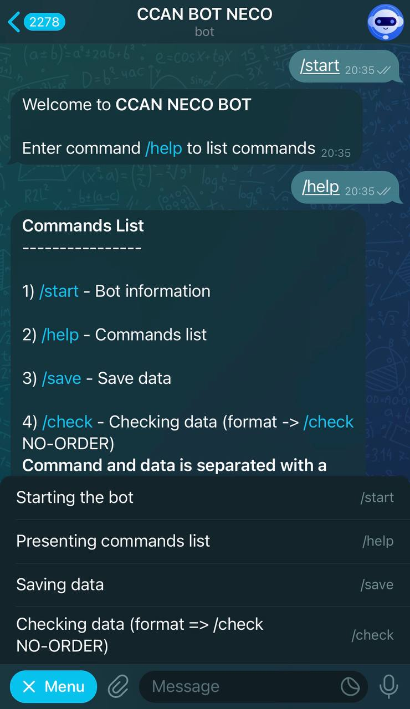
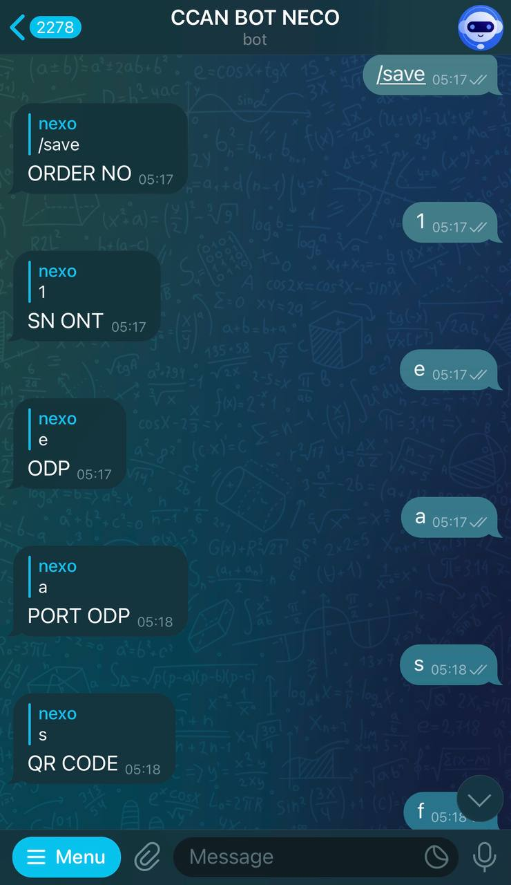
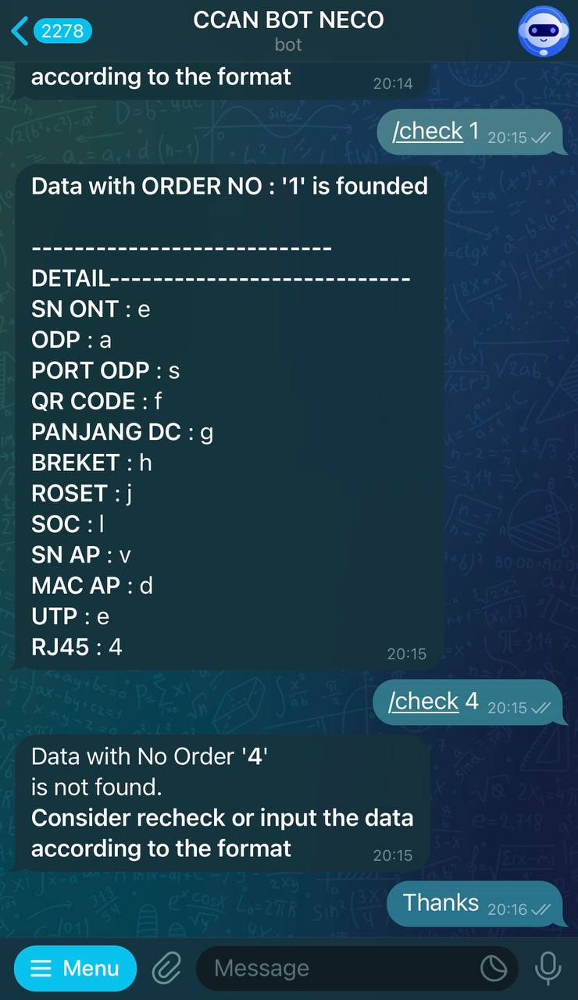

# Telegram bot to automate tasks with Google Apps Script

## Introduction

A bot to organize data from Google Spreadsheet through Telegram Bot.There are two main function of this bot; save and check data in accordance with the Google Sheets table.

Users can input some data by following instructions of the bot as well as checking data that has been input. User registration and authentication feature will soon be added to the bot.

## Technologies

    

## General Steps

1. Create a new project on [Google Apps Script](https://www.google.com/script/start/)
2. Create Telegram bot with @BotFather and manage everything you need.
3. Integrate the bot with Google Sheets via Apps Script

## Steps

> [!NOTE]  
> Detailed steps will be included soon

## Documentation

    
    
    
    

